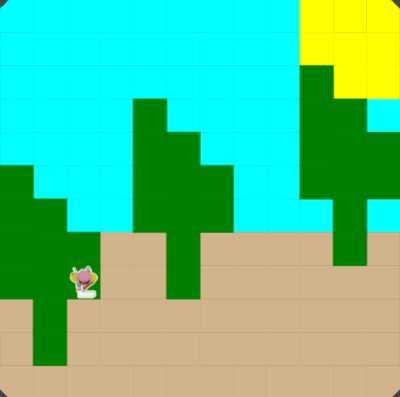

# Unit 1 - Asphalt Art

## Introduction

Cities use asphalt art to improve public safety, inspire their residents and visitors, and brighten communities. Your goal is to create asphalt art to revitalize The Neighborhood and bring the community together with the help of the Painter.

## Requirements

Use your knowledge of object-oriented programming, algorithms, the problem solving process, and decomposition strategies to create asphalt art:
- **Create a new subclass** – Create at least one new subclass of the PainterPlus class that is used for a component of the asphalt art design.
- **Plan an algorithm** – Use the problem solving process and decomposition strategies to plan an algorithm that incorporates a combination of sequencing, selection, and/or iteration.
- **Write a method** – Write at least one method in a PainterPlus subclass that contributes to a component of the asphalt art design.
- **Document your code** – Use comments to explain the purpose of the methods and code segments.

## Notes: Neighborhood & Painter Class

This project was created on Code.org's JavaLab platform using the built-in Neighborhood GUI output. To test and edit this project you must build in Code.org's JavaLab with the Neighborhood GUI enabled. For reference to the Painter class documentation, [you can read more here.](https://studio.code.org/docs/ide/javalab/classes/Painter)

## Output:

## Reflection

1. Describe your project.
My project is a digital painting of a nature scene. I used a painter to create a canvas with a blue sky, a yellow sun, green trees, brown ground, and a small character. I created the scene by placing and painting different shapes and colors on the canvas using Java.
2. What are two things about your project that you are proud of?
Two things I am proud of are the colors and the overall design. I like how the bright blue sky and yellow sun contrast with the green trees and brown ground. I am also proud of how I arranged the different shapes to create a complete outdoor scene.
3. Describe something you would improve or do differently if you had an opportunity to change something about your project.
If I could change something, I would add more details to the painting. For example, I could add clouds, more plants, shadows, or details to the trees and character. I would also make some of the shapes more detailed instead of keeping them mostly simple and block-like.
4. How is this project related to STEAM (Science, Technology, Engineering, Art, and Mathematics)? Provide explicit examples from the project and details as possible. 

My project relates to STEAM in several ways:

- Science: I included parts of a natural environment, such as trees, grass, the ground, and the sun.
- Technology: I used a digital painter and computer technology to create the artwork on a canvas.
- Engineering: I had to plan where to place each object and figure out how the different shapes would fit together on the canvas.
- Art: Art is the main part of my project. I chose the colors, shapes, composition, and layout to create the scene I wanted.
Mathematics: I used the canvas grid, shapes, spacing, and proportions to position the different parts of the painting accurately.
5. What SLOs did you demonstrate during completing this project?
I demonstrated creativity, problem-solving, communication, and perseverance. I used creativity to design my own scene and choose its colors and objects. I used problem-solving to figure out how to create the different parts of the painting using the digital painter. I demonstrated perseverance by continuing to work on the canvas and making adjustments to my design. I also demonstrated technology skills by using the digital painting program to create my project.